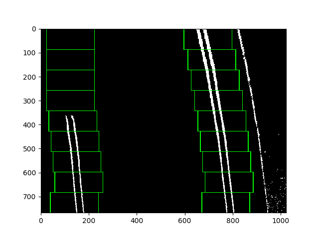
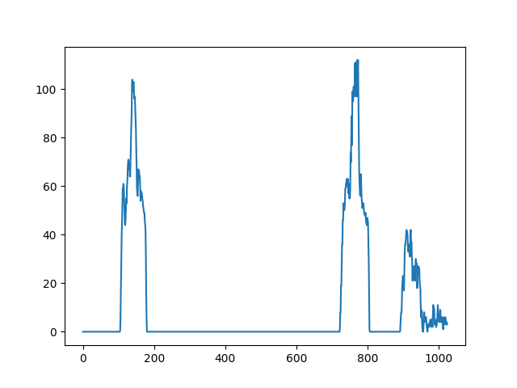
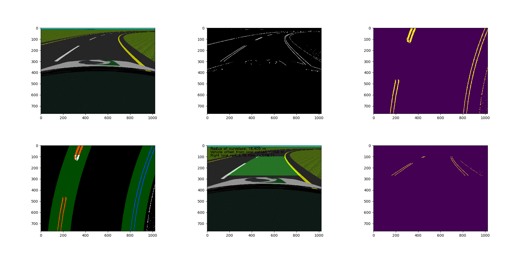
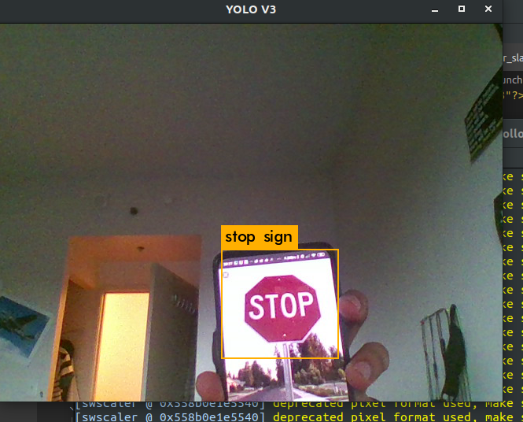
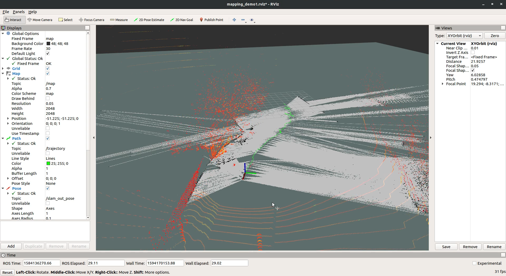
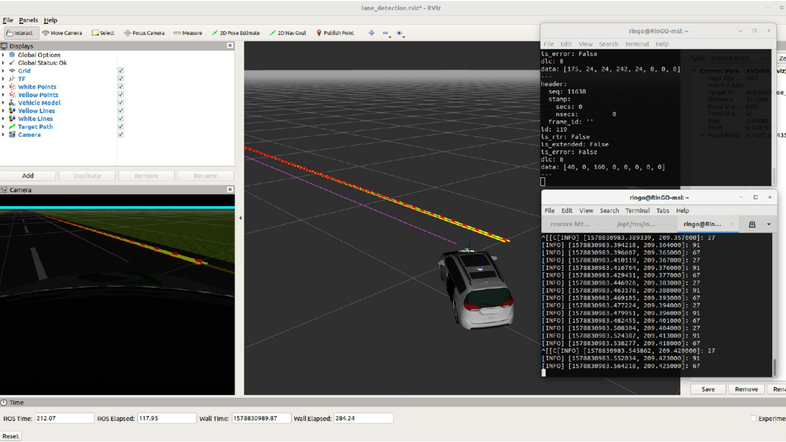

# Overview
ROS workspace for a Self-Driving Polaris GEM e2 golf cart using Dataspeed's drive-by-wire package.

#### Clone the repo and build package using `catkin_make`

### Lane Detection

The lane keeping package uses OpenCV that detects white/yellow lanes and publishes Radius of Curvature and offset from middle of lane. Uses HLS color space to threshold and histogram to classify lanes. 
`rosrun lane_follower lane_tracker.py` will launch the lane tracking node and publishes offset on /laneOffset topic.

### Object Detection
Has a neural network object detection package based on darkNET's yolo v3. Forked from [leggedrobotics](https://github.com/leggedrobotics/darknet_ros) 
`roslaunch darknet_ros/darknet_ros yolo_v3` will launch the object detection node. Current image topic is set to /usb_cam/image_raw and can be configured in config/ros.yaml

### SLAM
`roslaunch car_teleop hector_slam_test.launch filename_true:=<bagfile.bag> path:=<folder location>` launches a HectorSLAM node without odometry with bag files with LiDAR/pointcloud data.

### Keyboard teleop for the simulator/cart
[lane_teleop.launch](src/car_teleop/launch/lane_teleop.launch) launches DataSpeed's DbW simulator. Also launches [keystroke.py](src/car_teleop/Scripts/keystroke.py) which kills the path planning node and publishes command velocity messages(UlcCmd). 
Use `roslaunch car_teleop lane_teleop` to launch the keyboard teleop node and use W-S-A-D to control the car in Gazebo.

