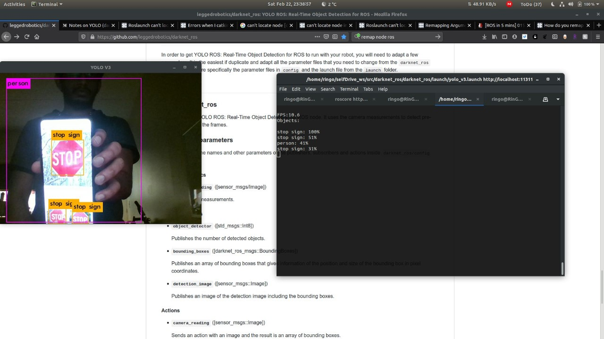
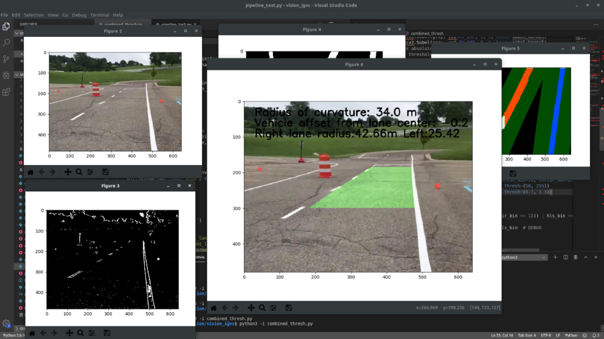

# Overview
ROS workspace for a Self-Driving Polaris GEM e2 golf car using Dataspeed's drive-by-wire package.

### Keyboard teleop for the simulator
lane_teleop launch file will launch DataSpeed's DbW simulator. keystroke.py kills the path planning node and publishes command velocity messages(UlcCmd).
`roslaunch car_teleop lane_teleop` to launch the keyboard teleop node. Use W-S-A-D to control the car in Gazebo.

### Object Detection
Has a neural network object detection package based on darkNET's yolo v3. Forked from [leggedrobotics](https://github.com/leggedrobotics/darknet_ros)
`roslaunch darknet_ros/darknet_ros yolo_v3` will launch the object detection node. 

### Lane Detection
The lane keeping package uses OpenCV that detects while lanes and publishes Radius of Curvature and offset from middle of lane.

